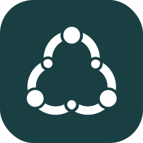

<!--lint disable no-literal-urls-->

   
  

<h1 align="center"><a href="https://openmarketplace.org"> Open Marketplace Apps</a></h1>

Open marketplace apps are decentralized open source apps for smart cities and local communities.

  
  

---

# Community

This is a documentation page for the #OMA community. With all information about governance, meetings, and contributors.

---

## Join us

There are different opportunities to join the OMA project.

### Become a contributor

Just add your GitHub handle, skills, and discord handle to the table below. You can just create a fork, change it and make a pull request with your changes. [TBD - Learn how it works here.](./how-tos/01-create-merge-request.md)

### Become a team member

If you want to join the team and become a part of the #OMA project, please introduce yourself in the `team-request` channel in our [Discord](https://discord.gg/XDQQcJC). For now the only difference between a contributor and a team member is simply the activity in discord and an official team request. But, we have the aspiration to get funded in the future and pay a salary to our team members.

### Local Leaders

A local leader brings the vision of #OMA to their city - with the mission to build up a local team, to fulfill the cities needs.

[Learn more about Local Leaders here.](./local-leaders/README.md)

In this early stage of the project, we search for `Local Leaders`.
If you want to become a `Local Leader` please introduce yourself in the `local-leader-request` channel in our [Discord](https://discord.gg/XDQQcJC).

---

## Working Groups

A working group, or working party, is a group of experts working together to achieve specified goals. The groups are domain-specific and focus on discussion or activity around a specific subject area.

- [TangleEE](https://tangle.ee/) - in progress
- [Open Street Map](https://www.openstreetmap.org) - in request

---

## Governance

This document is to be understood as a supplement to our articles of association. Here we examine again our mission statement, the members, organs, department and projects.

[Our Association.](./governance/README.md)

> “Never doubt that a small group of thoughtful, committed, citizens can change the world. Indeed, it is the only thing that ever has.”
>
> ― Margaret Mead

---

## Further reading

All articles from [our Medium Blog](https://medium.com/open-marketplace-applications).
